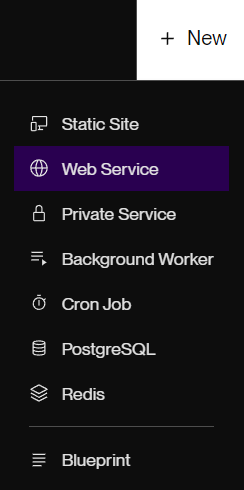
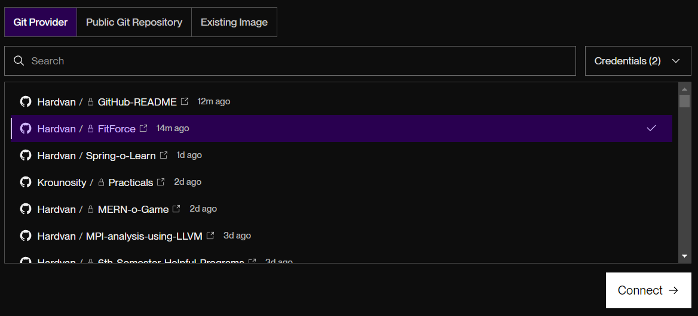
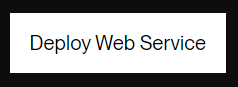
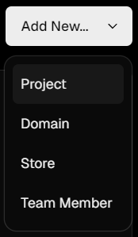
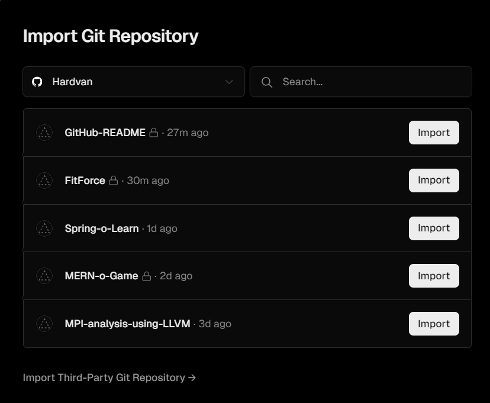
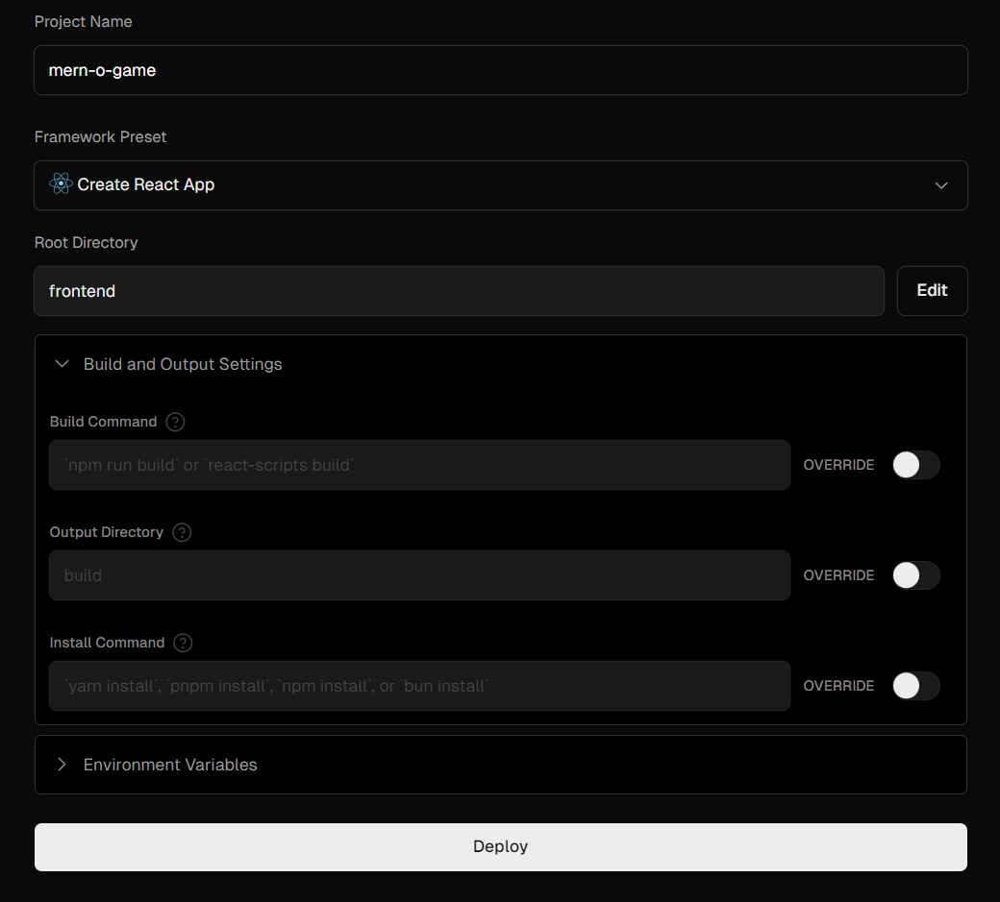

# How to Deploy a MERN APP

## MERN Project Structure Assumption

The MERN project structure is assumed to be as follows:

```plaintext
backend/
├── node_modules/
├── server.js
├── package.json
└── ...
frontend/
├── node_modules/
├── public/
├── src/
├── package.json
└── ...
...
```

## Deploy Backend on Render

1. Create a new `Web Service` on Render.

   

2. Choose the GitHub repository to deploy from.

   

3. Set the following configurations:

   - **Language**: `Node`
   - **Root Directory**: `backend`
   - **Build Command**: `npm install`
   - **Start Command**: `node server.js`
     > Note: Replace `server.js` with the main file of the backend project.

   

4. Click on `Deploy` to deploy the backend API.

   

## Deploy Frontend on Vercel

1. Click on the `New Project` button.

   

2. Choose the GitHub repository to deploy from.

   

3. Set the following configurations:

   - **Framework Preset**: `Create React App`
   - **Root Directory**: `frontend`
   - **Build Command**: `npm run build`
   - **Output Directory**: `build`

   

4. Click on `Deploy` to deploy the frontend project.

> Note: The backend API URL can be configured to be used in the frontend project by using the `.env` file:
>
> - Create a `.env` file in the frontend project with the following content:
>
> ```plaintext
> REACT_APP_API_URL=https://localhost:5000
> ```
>
> - Use the `process.env.REACT_APP_API_URL` in the frontend project to access the backend API URL.
>
> - After deploying the frontend project on Vercel, add the `REACT_APP_API_URL` environment variable in the Vercel project settings and set the value to the backend API URL on Render.

Voilà! The MERN app is now deployed on Render and Vercel. To use the app, access the frontend URL provided by Vercel. (The backend API URL will be implicitly used by the frontend app.)
